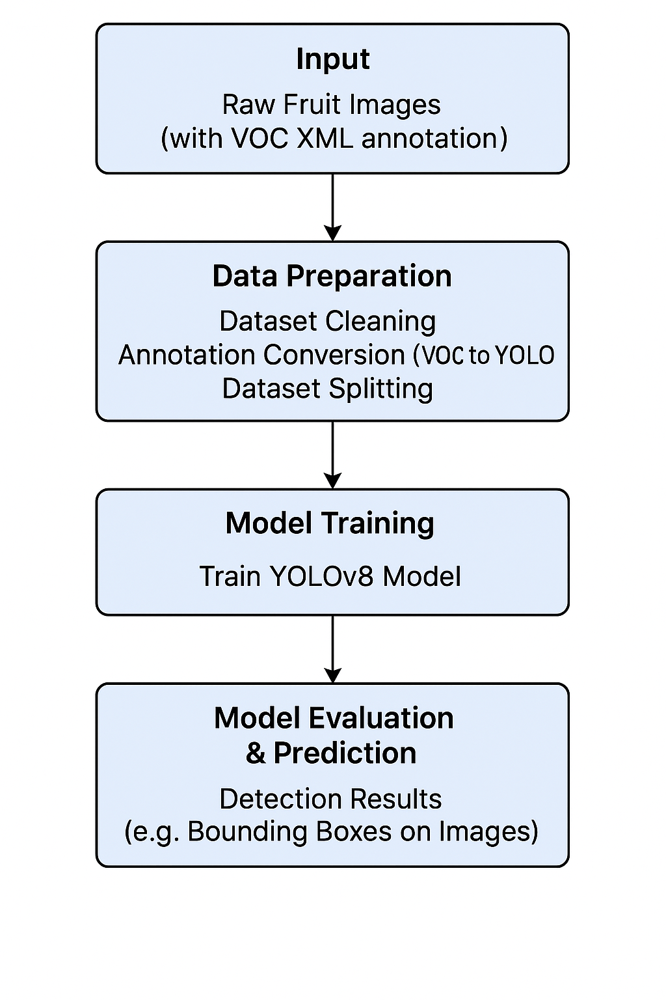
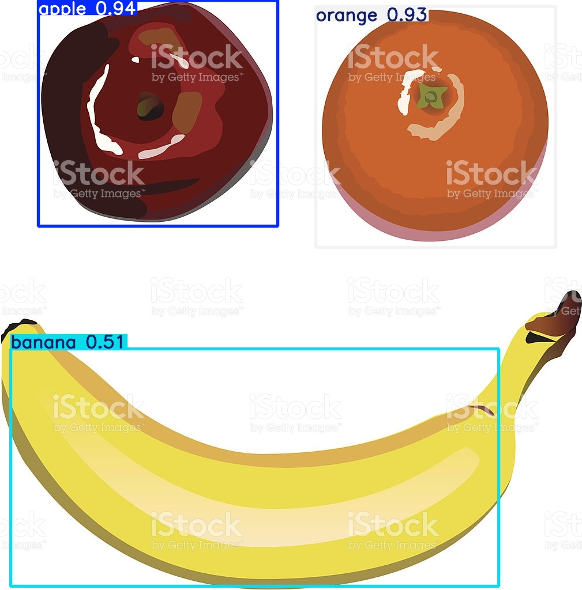

# **Computer Vision Project: Automated Fruit Detection using YOLO**

## **Table of Contents**
*   [Problem Statement](#problem-statement)
*   [Overall Project Goal](#overall-project-goal)
*   [Key Technologies and Libraries Used](#key-technologies-and-libraries-used)
*   [Project Pipeline](#project-pipeline)
    *   [Phase 1: Data Acquisition & Initial Preparation](#phase-1-data-acquisition--initial-preparation)
    *   [Phase 2: Dataset Cleaning](#phase-2-dataset-cleaning)
    *   [Phase 3: Annotation Conversion (VOC to YOLO Format)](#phase-3-annotation-conversion-voc-to-yolo-format)
    *   [Phase 4: Dataset Splitting](#phase-4-dataset-splitting)
    *   [Phase 5: YOLO Model Training](#phase-5-yolo-model-training)
    *   [Phase 6: Model Evaluation & Prediction](#phase-6-model-evaluation--prediction)
*   [Model Performance Metrics](#model-performance-metrics)
*   [Getting Started](#getting-started)
    *   [Prerequisites](#prerequisites)
    *   [Installation](#installation)
    *   [Running the Pipeline](#running-the-pipeline)
*   [Project Structure](#project-structure)
*   [Contributing](#contributing)
*   [Contact](#contact)

---

## **Problem Statement**
Accurate and automated identification of fruits in images is crucial for various applications, including quality control in agriculture, automated sorting systems, and inventory management. This project aims to develop a robust computer vision solution for detecting different types of fruits within images.

## **Overall Project Goal**
To design, develop, and implement a complete computer vision pipeline for fruit object detection using the YOLO (You Only Look Once) model. This project covers all stages from raw data preparation and cleaning to model training, evaluation, and custom prediction.

## **Key Technologies and Libraries Used**
*   **Python:** Primary programming language.
*   **OpenCV (`cv2`):** For image processing tasks.
*   **NumPy:** For efficient numerical operations.
*   **Ultralytics (`YOLO`):** For state-of-the-art object detection (YOLOv8).
*   **Pandas:** For data handling (if applicable).
*   **Scikit-learn:** For data splitting.
*   **Git:** For version control.

## **Project Pipeline**
This project outlines a comprehensive pipeline for developing an object detection model for fruit images.

<div align="center">

</div>

### **Phase 1: Data Acquisition & Initial Preparation**
*   **Process:** Raw fruit image datasets are acquired. These datasets typically come with annotations in various formats (e.g., Pascal VOC XML).
*   **Data Location:** Raw images and their initial annotations are stored within the `dataset/` directory.

### **Phase 2: Dataset Cleaning**
*   **Script:** `cleaning_dataset.py`
*   **Purpose:** This crucial step ensures the quality and consistency of the dataset. It involves identifying and handling corrupted images, incorrect annotations, or irrelevant data points that could negatively impact model training.
*   **Process:** The script automates checks and corrections to prepare a clean dataset for subsequent steps.

### **Phase 3: Annotation Conversion (VOC to YOLO Format)**
*   **Script:** `voc_to_yolo.py`
*   **Purpose:** Object detection models like YOLO require annotations in a specific format (normalized bounding box coordinates in `.txt` files). This phase converts annotations from common formats (like Pascal VOC XML) to the YOLO format.
*   **Process:** The script reads XML annotation files, extracts bounding box information and class labels, and converts them into YOLO-compatible `.txt` files.

### **Phase 4: Dataset Splitting**
*   **Script:** `split_dataset.py`
*   **Purpose:** To divide the prepared dataset into distinct training, validation, and (optionally) testing sets. This ensures unbiased evaluation of the model's performance on unseen data.
*   **Process:** The script systematically splits the image and corresponding label files into appropriate directories (e.g., `train/`, `val/`, `test/`).

### **Phase 5: YOLO Model Training**
*   **Script:** `train_fruit_yolov8.py`
*   **Purpose:** To train a YOLOv8 object detection model on the prepared fruit image dataset.
*   **Process:** The script loads a pre-trained YOLOv8 model (e.g., `yolov8n.pt`) and fine-tunes it using the custom fruit dataset. Training parameters like epochs, image size, and batch size are configured.
*   **Output:** A trained YOLO model (`best.pt`) saved in the `runs/` directory.

### **Phase 6: Model Evaluation & Prediction**
*   **Scripts:** `test_model.py`, `predict_on_test.py`, `predict_custom.py`
*   **Purpose:** To assess the performance of the trained YOLO model and use it for inference on new images.
*   **Process:**
    *   `test_model.py`: Evaluates the model on a dedicated test set, generating performance metrics.
    *   `predict_on_test.py`: Runs predictions on the test set to visualize model output.
    *   `predict_custom.py`: Allows for making predictions on arbitrary new images.

## **Model Performance Metrics**
Performance metrics for the YOLO model (e.g., mAP, Precision, Recall, F1-score) are generated during the training and evaluation phases and typically stored in the `runs/` directory. These include plots like `results.png`, `confusion_matrix.png`, and various PR curves.

### **YOLOv8 Object Detection Model Performance**
The custom-trained YOLOv8 model's performance was rigorously evaluated during its fine-tuning process, demonstrating strong object detection capabilities for the defined classes.

<div align="center">
    <table>
        <tr>
            <td></td>
            <td></td>
        </tr>
        <tr>
            <td colspan="2" align="center"></td>
        </tr>
    </table>
</div>

### **YOLO Prediction Examples**
Here are some examples of the YOLO model's detection capabilities on fruit images.

<div align="center">
    <table>
        <tr>
            <td></td>
            <td></td>
        </tr>
        <tr>
            <td colspan="2" align="center"></td>
        </tr>
    </table>
</div>

## **Project Outcomes & Deliverables**
This project successfully delivers a robust and functional AI solution:

*   **End-to-End Pipeline:** A complete system from raw data to actionable insights.
*   **Automated Object Detection:** Capable of automatically identifying fruits in images.
*   **Custom Model Development:** Fine-tuned YOLO model for precise, domain-specific object detection.
*   **Reproducible Research:** The project structure and scripts allow for easy reproduction of the pipeline.

## **Getting Started**

### **Prerequisites**
*   **Python 3.8+:** Ensure Python is installed and added to your PATH.
*   **Git:** For cloning the repository.
*   **FFmpeg:** (Optional, but recommended for initial frame extraction) Download and add to your system's PATH.

### **Installation**
1.  **Clone the repository:**
    ```bash
    git clone https://github.com/talha-shafique/Computer-Vision-based-Fruit-Detection-using-YOLO.git
    cd your-repo-name
    ```
    *(Replace `your-username` and `your-repo-name` with your actual GitHub details)*
2.  **Create a virtual environment (recommended):**
    ```bash
    python -m venv venv
    # On Windows
    .\venv\Scripts\activate
    # On macOS/Linux
    source venv/bin/activate
    ```
3.  **Install dependencies:**
    *(Note: You will need to generate a `requirements.txt` file by running `pip freeze > requirements.txt` after installing all libraries used in the project.)*    
    ```bash
    pip install -r requirements.txt
    ```

## **Running the Pipeline**
This section guides you through running each step of the project's pipeline. Ensure you are in the project's root directory for these commands.

### **Step 1: Data Acquisition & Initial Preparation**
*   **Action:** Place your raw fruit image data (images and VOC XML annotations) into the `dataset/` folder.

### **Step 2: Dataset Cleaning**
*   **Run:**
    ```bash
    python cleaning_dataset.py
    ```

### **Step 3: Annotation Conversion (VOC to YOLO Format)**
*   **Run:**
    ```bash
    python voc_to_yolo.py
    ```

### **Step 4: Dataset Splitting**
*   **Run:**
    ```bash
    python split_dataset.py
    ```

### **Step 5: YOLO Model Training**
*   **Run:**
    ```bash
    python train_fruit_yolov8.py
    ```

### **Step 6: Model Evaluation & Prediction**
*   **Run (Evaluation):**
    ```bash
    python test_model.py
    ```
*   **Run (Prediction on Test Set):**
    ```bash
    python predict_on_test.py
    ```
*   **Run (Custom Prediction):**
    ```bash
    python predict_custom.py
    ```

## **Project Structure**
```
.
├── dataset/                    # Raw and processed image data
├── .gitignore                  # Specifies files/folders to ignore in Git
├── cleaning_dataset.py         # Script for dataset cleaning
├── data.yaml                   # YOLO dataset configuration
├── predict_custom.py           # Script for custom predictions
├── predict_on_test.py          # Script for predictions on test set
├── requirements.txt            # Python dependencies
├── split_dataset.py            # Script for splitting dataset
├── test_model.py               # Script for model testing
├── train_fruit_yolov8.py       # Script for YOLO model training
├── voc_to_yolo.py              # Script for VOC to YOLO annotation conversion
└── README.md                   # This file
```
*(The following items are generated during the pipeline or are temporary/external and are ignored by Git to keep the repository lean. They will be created/downloaded when you run the relevant scripts.)*    
```
├── runs/                       # YOLO training/prediction outputs
├── venv/                       # Python virtual environment
├── yolov8n.pt                  # Pre-trained YOLOv8 weights

```

## **Contributing**
Contributions are welcome! If you have suggestions for improvements or new features, please open an issue or submit a pull request.

## **Contact**
*   GitHub: https://github.com/talha-shafique
*   Email: talha.shafique126@gmail.com

---
